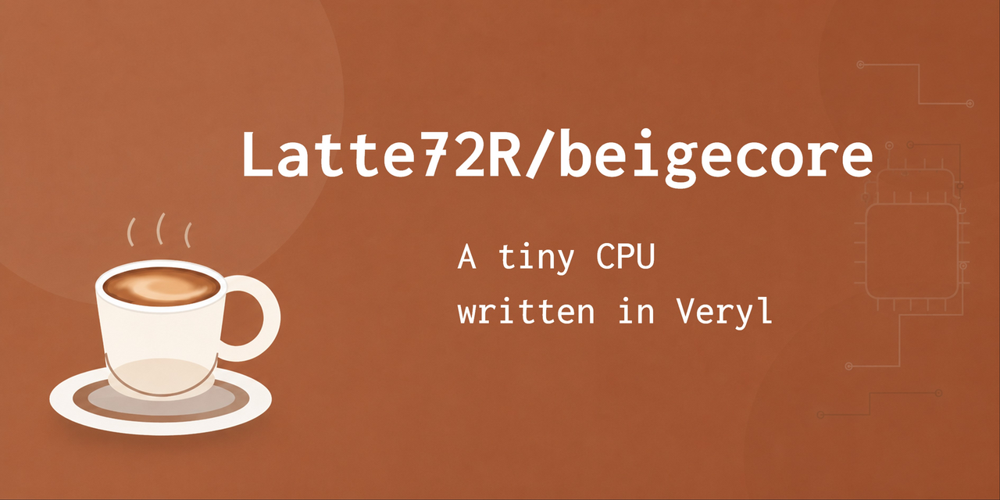

# beigecore



Veryl で実装された，RV64IM 命令をサポートする RISC-V プロセッサコアです．

## 必要なツール

- [Veryl](https://github.com/veryl-lang/verylup)
- [Verilator](https://github.com/verilator/verilator)
- [RISC-V GNU Toolchain](https://github.com/riscv-collab/riscv-gnu-toolchain)

riscv-tests によるテストと CoreMark によるベンチマークを利用するには以下のコマンドの実行が必要です．

```sh
git submodule update --init --recursive
```

## 使い方

```sh
make build   # Verylソースの整形とビルド
make sim     # Verilatorシミュレータをビルド
make test    # riscv-tests を実行
make bench   # CoreMark を実行
make synth   # タイミング・面積レポートを生成
```

単独の C プログラムは，次のようにクロスコンパイルして実行できます．

```sh
make debug FILE=debug_output.c
```
